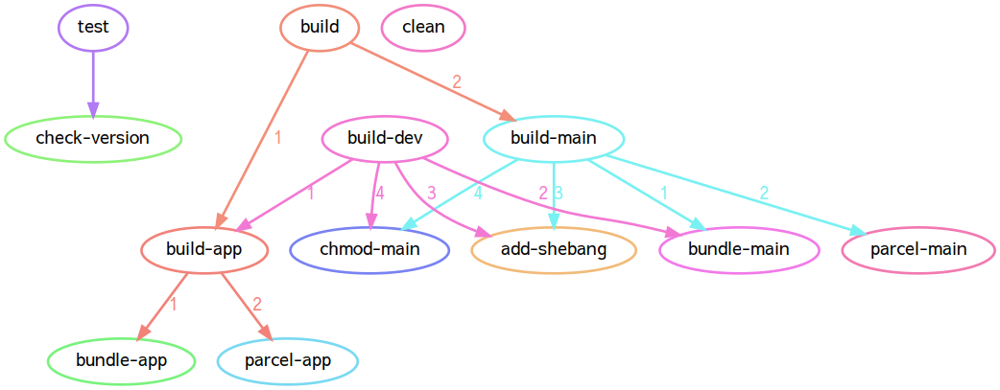

# npm-run-graph

Sometimes using task runners isn't desired, and we end up adding a lot of fields to the `scripts` section of a `package.json`.

This tiny (<50 LOC) script helps to visualize the build process by drawing a graph showing how `npm run` commands depend on each other.

An example of such a graph for a real-world project:



[Graphviz](https://graphviz.org/) is a runtime dependency.

## Usage

```bash
$ npm-run-graph
# (some output in graphiz format)
$ ls 
# (some files)
npm-run-graph.png
```
